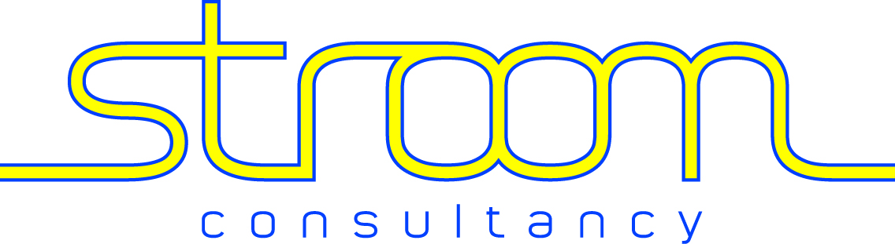
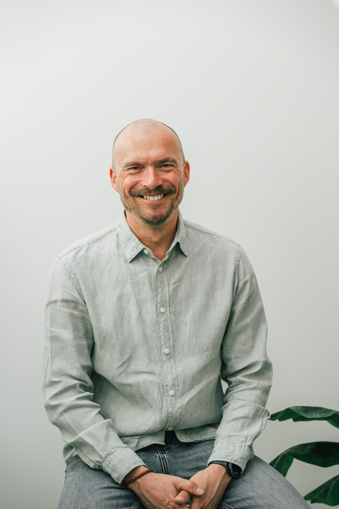
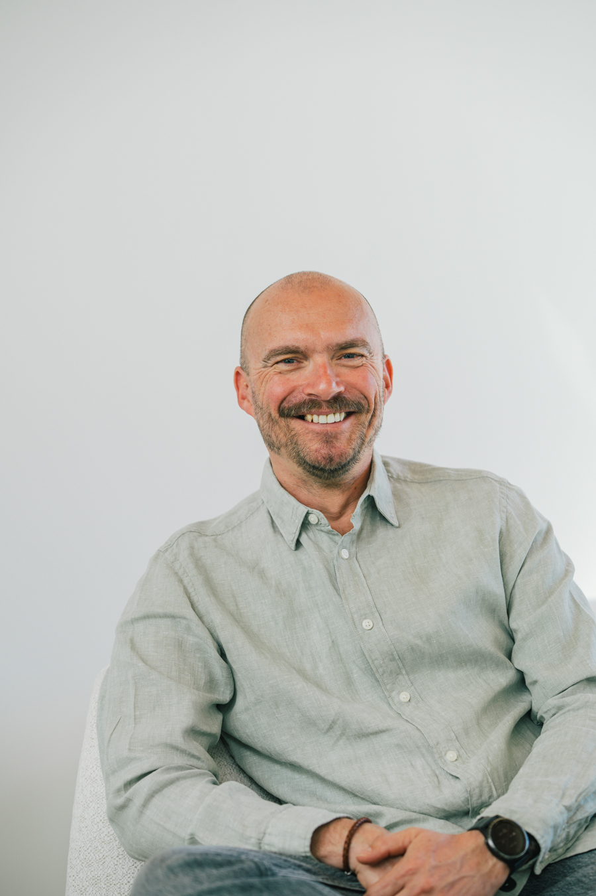

# Handleiding — Stroom-Consultancy Website

> Deze handleiding legt uit hoe de website is opgebouwd, hoe je tekst en foto's aanpast, en hoe je nieuwe pagina's toevoegt.

---

## Inhoudsopgave

1. [Bestandsstructuur](#1-bestandsstructuur)
2. [Hoe de navigatie en footer werken](#2-hoe-de-navigatie-en-footer-werken)
3. [Foto's aanpassen of toevoegen](#3-fotos-aanpassen-of-toevoegen)
4. [Pagina: index.html (Homepagina)](#4-pagina-indexhtml-homepagina)
5. [Pagina: OverMij.html](#5-pagina-overmijhtml)
6. [Stijlen aanpassen (style.css)](#6-stijlen-aanpassen-stylecss)
7. [Nieuwe pagina toevoegen](#7-nieuwe-pagina-toevoegen)
8. [Kleuren en lettertypes](#8-kleuren-en-lettertypes)

---

## 1. Bestandsstructuur

```
/
├── index.html          ← Homepagina
├── OverMij.html        ← "Wie ben ik?" pagina
├── style.css           ← Alle stijlen (kleuren, layout, lettertype)
├── javascript.js       ← Navigatie en footer (gedeeld over alle pagina's)
└── img/                ← Map met alle afbeeldingen
    ├── favicon/
    │   └── favicon.ico
    ├── Stroom_logo_def-1.jpg     ← Logo in de navigatie
    ├── Stroom_logo_achtergond.png ← Watermark op de achtergrond
    ├── intro.jpg                 ← Foto in de intro van de homepagina
    ├── over-stroom.jpg           ← Foto in het "Over ons" blok (home)
    └── over-mij.jpg              ← Foto op de OverMij pagina
```

> **Tip:** Alle foto's bewaar je in de `img/` map. Gebruik beschrijvende namen zonder spaties, bv. `geert-portret.jpg`.

---

## 2. Hoe de navigatie en footer werken

De navigatie en footer worden **automatisch** op elke pagina geladen via `javascript.js`. Je hoeft ze maar **één keer** aan te passen en ze veranderen overal tegelijk.

### Navigatielinks aanpassen

Open `javascript.js` en zoek het stuk `NAV_HTML`:

```javascript
const NAV_HTML = `
  <nav class="navcontainer">
    
    <div class="linkcontainer">
      <a class="linkNaarWebsite" href="index.html">Home</a>
      <a class="linkNaarWebsite" href="OverMij.html">Wie ben ik?</a>
    </div>
    ...
  </nav>`;
```

- **Logo vervangen:** Pas `src="img/Stroom-logo-navigatiebalk.jpg"` aan naar de naam van je nieuwe logo (zet het bestand in de `img/` map).
- **Link toevoegen:** Voeg een nieuwe regel toe, bv.:
  ```html
  <a class="linkNaarWebsite" href="Diensten.html">Diensten</a>
  ```
- **Link verwijderen:** Verwijder de bijhorende `<a ...>` regel.

### Logo afbeelding vervangen

📷 **Foto-aanpassing:** Vervang het bestand `img/Stroom-logo-navigatiebalk.jpg` door jouw nieuwe logo. Gebruik **dezelfde bestandsnaam**, of pas de `src` in `javascript.js` aan.

### Footer aanpassen

Zoek `FOOTER_HTML` in `javascript.js`:

```javascript
const FOOTER_HTML = `
  <footer class="contactcontainer">
    ...
    <a class="footer-link" href="mailto:info@stroom-consultancy.be">
      info@stroom-consultancy.be
    </a>
    ...
  </footer>`;
```

- **E-mailadres aanpassen:** Verander `info@stroom-consultancy.be` op twee plaatsen (de `href` en de zichtbare tekst).
- **Bedrijfsnaam aanpassen:** Zoek `Stroom‑Consultancy` en pas aan.

---

## 3. Foto's aanpassen of toevoegen

### Foto vervangen (bestaande pagina)

1. Zet je nieuwe foto in de `img/` map.
2. Zoek in het HTML-bestand de `` tag die je wil vervangen.
3. Pas het `src`-attribuut aan naar jouw nieuwe bestandsnaam.

**Voorbeeld:**
```html
<!-- Oud -->


<!-- Nieuw -->

```

> **Tip:** Het `alt`-attribuut is een beschrijving van de foto voor mensen die de foto niet kunnen zien. Vul dit altijd in.

### Overzicht van alle foto-plekken

| Pagina | Locatie in de code | Bestandsnaam |
|---|---|---|
| Homepagina | Intro rechts (grote portretfoto) | `img/intro.jpg` |
| Homepagina | "Over Stroom" sectie | `img/over-stroom.jpg` |
| OverMij | Intro rechts (portretfoto) | `img/over-mij.jpg` |
| Navigatie (alle pagina's) | Logo | `img/Stroom-logo-navigatiebalk.jpg` |
| Alle pagina's | Achtergrondwatermark | `img/Stroom_logo_achtergond.png` |

### Aanbevolen afmetingen

| Gebruik | Aanbevolen formaat |
|---|---|
| Portretfoto (intro/OverMij) | 800 × 1000 px of hoger, staand formaat |
| "Over ons" blok | 600 × 800 px, staand formaat |
| Logo | 400 × 150 px, liggend, transparante achtergrond (PNG) |
| Watermark achtergrond | PNG met transparante achtergrond |

---

## 4. Pagina: index.html (Homepagina)

De homepagina bestaat uit de volgende blokken van boven naar onder:

### 4.1 Intro-blok

```html
<div class="introcontainer">
  <div class="introcontainerlinks">
    <!-- Tagline (klein label bovenaan) -->
    <p class="tagline">Leadership & Organisatie</p>

    <!-- Grote titel -->
    <h1 class="introcontainertitle">
      Stroom‑Consultancy <em>— Brengt beweging...</em>
    </h1>

    <!-- Introductietekst -->
    <div class="introcontainerbody">
      <p>Verandering vraagt meer dan nieuwe processen...</p>
    </div>

    <!-- Knop -->
    <a href="mailto:info@stroom-consultancy.be" class="btn-primary">Plan een gesprek →</a>
  </div>

  <!-- 📷 FOTO RECHTS: vervang intro.jpg door jouw portretfoto -->
  <div class="introcontainerrechts">
    
  </div>
</div>
```

**Wat aanpassen:**
- Tagline, titel en tekst: gewoon de tekst tussen de tags vervangen.
- Knop: het `href="mailto:..."` aanpassen naar jouw e-mailadres of een andere link.
- 📷 Foto: `img/intro.jpg` vervangen (zie sectie 3).

---

### 4.2 Klanten-blok

```html
<div class="klanten-blok">
  <div class="klanten-rij">
    <span class="klant-naam">DSS+</span>
    <span class="klant-scheiding">·</span>
    <span class="klant-naam">Advario</span>
    ...
  </div>
</div>
```

**Klant toevoegen:** Voeg toe aan het einde van de rij:
```html
<span class="klant-scheiding">·</span>
<span class="klant-naam">Nieuwe Klant</span>
```

**Klant verwijderen:** Verwijder de bijhorende `<span class="klant-naam">` én de `<span class="klant-scheiding">` ervoor.

---

### 4.3 Diensten-blok

Elke dienst is een kaart:

```html
<div class="dienst-card">
  <span class="dienst-nr">01</span>
  <h3>Mindset & Behaviour Change</h3>
  <p>Verandering start in het hoofd...</p>
  <ul>
    <li>vastgeroeste patronen te doorbreken</li>
    <li>...</li>
  </ul>
  <p class="dienst-footer">Onze interventies zijn direct...</p>
</div>
```

**Dienst aanpassen:** Pas de tekst in `<h3>`, `<p>` en `<li>` aan.  
**Dienst toevoegen:** Kopieer een volledig `<div class="dienst-card">` blok en pas de inhoud aan. Vergeet de nummering (`dienst-nr`) bij te werken.

---

### 4.4 Quote-blokken

Er zijn 3 soorten quotes op de homepagina:

```html
<!-- Grote quote -->
<div class="quote-blok-groot">
  <p>Niets verandert… totdat mensen veranderen.</p>
</div>

<!-- Quote met categorie -->
<div class="quote-blok-enkelvoudig">
  <span class="quote-categorie">Samenwerking</span>
  <p>"Samenwerking ontstaat niet door afspraken..."</p>
</div>

<!-- Subtiele oneliner -->
<div class="quote-blok-oneliner">
  <p>Zodra het team in Stroom komt, volgt de rest vanzelf.</p>
</div>
```

**Aanpassen:** Vervang de tekst tussen de `<p>` tags.

---

### 4.5 Aanpak-blok (3 stappen)

```html
<div class="aanpak-stap">
  <span class="aanpak-nr">1</span>
  <div class="aanpak-tekst">
    <h3>Diagnostiek & gesprek</h3>
    <p>We brengen krachten, patronen en knelpunten in kaart...</p>
  </div>
</div>
```

**Stap aanpassen:** Pas `<h3>` en `<p>` aan.

---

### 4.6 Over Stroom-blok

```html
<div class="over-container">
  <!-- 📷 FOTO LINKS: vervang over-stroom.jpg door jouw foto -->
  <div class="over-foto">
    
  </div>
  <div class="over-tekst">
    <h2 class="over-title">Over Stroom‑Consultancy</h2>
    <p class="over-lead">...</p>
    <p class="over-body">...</p>
    <a href="mailto:info@stroom-consultancy.be" class="btn-primary btn-dark">Plan een gesprek →</a>
  </div>
</div>
```

📷 **Foto:** Vervang `img/over-stroom.jpg` (zie sectie 3).

---

## 5. Pagina: OverMij.html

### 5.1 Intro

```html
<div class="overmij-intro">
  <div class="overmij-intro-tekst">
    <p class="overmij-intro-tagline">Wie ben ik</p>
    <h1 class="overmij-intro-titel">Geert Lambrechts</h1>
    <p class="overmij-intro-ondertitel">Waar beweging ontstaat, begint verandering.</p>
  </div>

  <!-- 📷 FOTO RECHTS: vervang over-mij.jpg door jouw foto -->
  <div class="overmij-intro-foto">
    
  </div>
</div>
```

📷 **Foto:** Vervang `img/over-mij.jpg`.

---

### 5.2 Achtergrond (statistieken)

```html
<div class="overmij-achtergrond-rechts">
  <div class="overmij-stat">
    <p class="overmij-stat-label">Sectoren</p>
    <p class="overmij-stat-waarde">Productie · Logistiek · Retail · ...</p>
  </div>
  ...
</div>
```

**Aanpassen:** Pas de tekst in `overmij-stat-waarde` aan.

---

### 5.3 Tools-grid (6 kaarten)

Elke tool is een kaart:

```html
<div class="overmij-tool-kaart">
  <div class="overmij-tool-nr">03</div>
  <h3 class="overmij-tool-naam">NLP</h3>
  <p class="overmij-tool-omschrijving">Voor bewustzijn, communicatie en mind set...</p>
</div>
```

**Tool aanpassen:** Pas `overmij-tool-naam` en `overmij-tool-omschrijving` aan.  
**Tool toevoegen:** Kopieer een kaart en pas de inhoud en het nummer aan.

---

### 5.4 CTA (Call-to-action onderaan)

```html
<div class="overmij-cta">
  <div class="overmij-cta-tekst">
    <h2>Klaar om de beweging terug te vinden?</h2>
    <p>Ik help leiders, teams en organisaties...</p>
  </div>
  <a href="mailto:info@stroom-consultancy.be" class="btn-primary-over-mij btn-dark-over-mij">
    Plan een gesprek →
  </a>
</div>
```

**Aanpassen:** Pas de titel, tekst en het e-mailadres aan.

---

## 6. Stijlen aanpassen (style.css)

### Kleuren aanpassen

Zoek de kleurcode in `style.css` en vervang:

| Kleur | Code | Gebruik |
|---|---|---|
| Donkerblauw | `#023C7A` | Achtergrond intro, titels |
| Lichtblauw | `#7ec8e3` | Accenten, knoppen |
| Donkerste blauw | `#012d5c` | Footer achtergrond |
| Crème/beige | `#f4f4f0` | Pagina-achtergrond |
| Wit | `#ffffff` | Kaarten, tekst op donkere achtergrond |

**Alle instanties in één keer aanpassen:** Gebruik Ctrl+H (zoek & vervang) in je teksteditor.

### Lettergrootte aanpassen

Zoek de class in `style.css`, bv.:
```css
.introcontainertitle {
    font-size: 26px; /* ← pas dit getal aan */
}
```

### Knop-stijl aanpassen

```css
.btn-primary {
    background-color: #7ec8e3; /* achtergrondkleur */
    color: #023C7A;             /* tekstkleur */
    border-radius: 6px;         /* afronding hoeken */
    padding: 12px 28px;         /* ruimte binnen de knop */
}
```

---

## 7. Nieuwe pagina toevoegen

1. Maak een nieuw HTML-bestand aan, bv. `Diensten.html`.
2. Kopieer de basisstructuur van `OverMij.html`:

```html
<!DOCTYPE html>
<html lang="nl">
<head>
    <meta charset="UTF-8">
    <meta name="viewport" content="width=device-width, initial-scale=1.0">
    <title>Diensten — Stroom-Consultancy</title>
    <link rel="stylesheet" href="style.css">
</head>
<body>
    <div class="body-watermark"></div>
    <div id="site-nav"></div>

    <main>
        <!-- Jouw inhoud hier -->
    </main>

    <div id="site-footer"></div>
    <script src="javascript.js"></script>
</body>
</html>
```

3. Voeg de link toe aan de navigatie in `javascript.js` (zie sectie 2).

---

## 8. Kleuren en lettertypes

### Lettertypes

De website gebruikt twee lettertypes van Google Fonts:

| Lettertype | Gebruik |
|---|---|
| **Playfair Display** | Titels, quotes, grote koppen |
| **Source Serif 4** | Broodtekst, taglines, navigatie |

Deze worden automatisch geladen. Wil je ze aanpassen, zoek dan in de HTML-bestanden naar:
```html
<link href="https://fonts.googleapis.com/css2?family=Playfair+Display...">
```

### Favicon (icoontje in browsertab)

Vervang het bestand `img/favicon/favicon.ico` door jouw eigen favicon (gebruik [favicon.io](https://favicon.io) om er een te maken).

---

*Handleiding gegenereerd voor Stroom-Consultancy website — versie 1.0*
